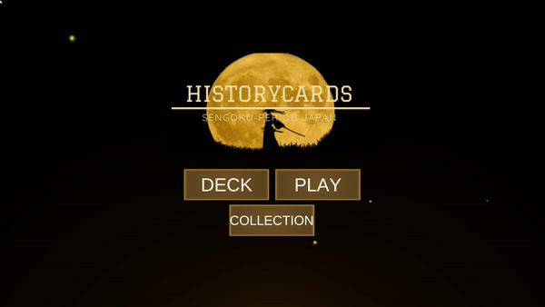

<h3 align="center"> Online Collecting Card Game: </h3>
 
 History Cards!  

WebGL build URL: (Play the game now!)

https://developer.cloud.unity3d.com/webgl/webgl.html?shareId=bJtPSJAaBd

 <!-- TABLE OF CONTENTS -->
## Table of Contents

* [About the Project](#about-the-project)
  * [An overview of what the project is and what it is meant to accomplish](#overview)
  * [Main Features](#main-features)
  * [Software & Languages](#software-and-languages)
  * [Sources](#sources)
* [How to access and run HistoryCards](#how-to-access-and-run-historycards)
* [Quality Attributes](#quality-attributes)
* [Software Architecture and Design Overview](#architecture-and-design)
* [Design Patterns](#design-patterns)
* [Final State of Software](#final-state-of-software)
  * [Known Bugs/Issues](#known-bugs-and-issues)
  * [Product Backlog](#product-backlog)
 
<!-- ABOUT THE PROJECT -->
## About The Project
 
This project is an online collecting card game created with an education purpose. The chosen subject of this game is the Sengoku period of Japanese history, a tumultuous periuod of political upheaval and strife. 

As a software project, this game serves as a months-long exploration of the Unity game engine. It required me to learn the Unity engine from the ground up. This involved learning Unity’s iterative visual workflow, scene management, C# scripting, asset creation and management, project collaboration, and deploying a build, of which I had no experience in prior.

### Overview
* The game itself is an online browser-based game, heavily inspired by Magic: The Gathering and Hearthstone.
* It is a single player card game, played against an A.I. opponent. 
* In addition to play mode, the project also contains a deck editor, collection viewer, and inventory system.
* The deck editor allows the player to edit and save their decks for future usage. 
* The collection viewer allows the player to view every card in the game and which cards they currently own. The inventory system allows the user to buy cards using points, which are earned by winning games. These cards can then be saved into decks and used in play mode.

### Main Features
 
* Users play head to head in a card game against a difficult scripted AI
* Users can use a premade deck, or edit a deck to their liking
* Users gain points from wins and can use points to buy more cards to add to a deck.
* Users can buy more cards and apply them to their deck within Collections
 
### Software and Languages
 
* Utilizes Unity WebGL
* C# for coding
* Unity takes C# and will compile it to run on a web plugin
* Python/MySQL for Database back-end

### Sources
 
* Using unity, I will use public domain images, fan-made art, and the unity art
package for trading card games and will be referencing each source. 
* DOTween (UnityAssetStore) to animate actions
* Card Design pack (UnityAssetStore)

<!-- GETTING STARTED -->
## How to Access and Run HistoryCards
 
Go to https://developer.cloud.unity3d.com/webgl/webgl.html?shareId=bJtPSJAaBd

<!-- USAGE EXAMPLES -->
## Usage
 
This section explains briefly how to play the game
### Deck Management

## DECKS

* The deck editor allows the user to create, edit, and save up to 3 custom decks. 
* There is a blue bar that displays the current average energy cost of the cards in the deck.
* If you click on a card, columns of available cards will show on the left that you can choose to replace the first card with.
* Reclicking the card closes the inventory.
* Note that you can buy more cards in the collection window to add to your deck.

## COLLECTIONS
* The collection viewer allows the user to view all the cards in the game and allows the user to purchase cards using points that are gained by winning games and starting with a few hundred in a new gaming session.
* The top panel has a text box listing the current page in the collection. 
* The center panel contains card slots displaying each card in the game, in order of ID number. 
* Hovering over a card opens up a tooltip text box, showing the card’s description. The collection also has a text box displaying the user’s current point total.
* For unowned cards, there is a banner button on the card. This button indicates to the user that the card is unowned and lists the price of the card, which depends on the card’s rarity.

### Gameplay

 
* The user plays the game against an AI in play mode. 
* In Play, The screen consists of the game board, your base's health, the player’s hand, a redraw button, an end turn button, and a quit button.
* The player’s hand is at the bottom of the screen. To play cards, the player drags cards to their respective zones.
* Creature cards are dragged into the middle section, representing the battlefield.
* Spell cards are dragged into the section labeled Spell Cards. All cards have a respective energy cost.
* Next to the player’s hand are additional control buttons for the user. The redraw button is a mulligan feature which draws a new hand from the user’s deck by expending two energy. 
* The game ends when one player’s health is reduced to 0. If the user is the winner, the user gains 50 points.
 
<!-- Quality Attributes -->
## Quality Attributes
 
1. **Reliability** – It is more important that features work predictably and reliably for the user, so I started with a limited number of core features to make sure they were done right. In testing of its reliability, the goal was to ensure for example if a user invoked a feature 10 times, that it would succeed 100% of the time.
2. **Testability** – Especially in the early days of this project’s development, I worked to ensure that features were easily testable and also thoroughly tested before being deployed.
3. **Learnability** – I desire to have intuitive features and ease of navigation to increase user retention.

<!-- FINAL STATE OF SOFTWARE -->
 
### Known Bugs and Issues
 
* On certain systems, if the user gets clicks randomly on the screen in extremely quick succession, the application can fail.
 
### Product Backlog
 
* As a user I can click a tutorial and see graphically what to do in the game.
* As a user I can play against another human person
